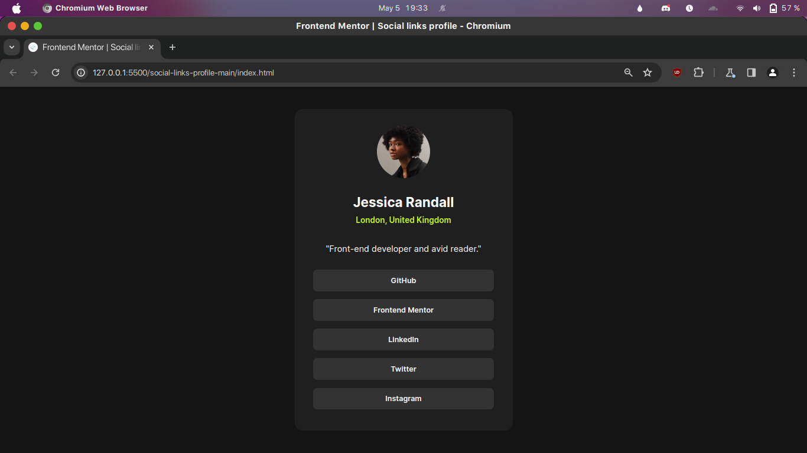
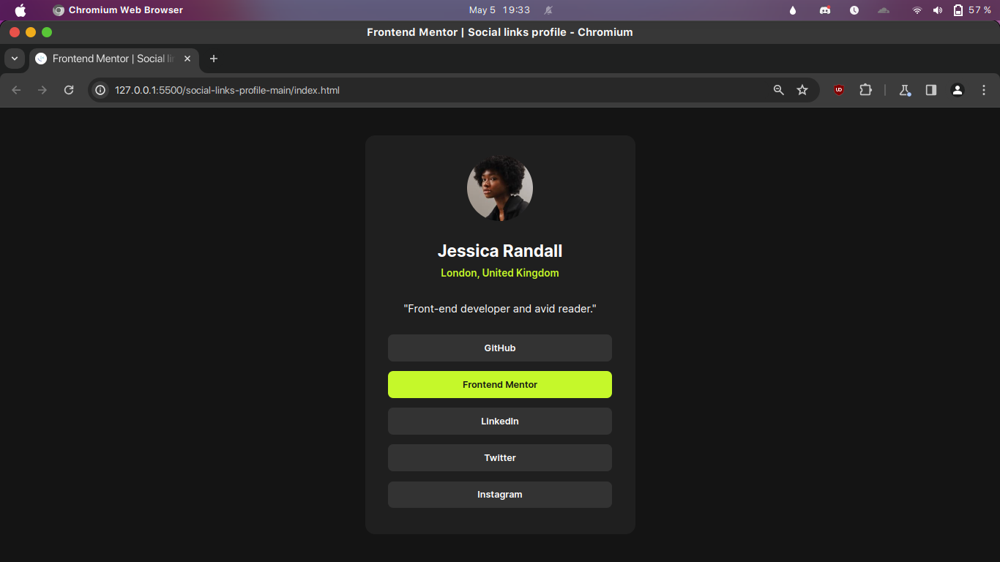

# Frontend Mentor - Social links profile solution

This is a solution to the [Social links profile challenge on Frontend Mentor](https://www.frontendmentor.io/challenges/social-links-profile-UG32l9m6dQ). Frontend Mentor challenges helped me improve my coding skills by building realistic projects. 

## Table of contents

- [Overview](#overview)
  - [The challenge](#the-challenge)
  - [Screenshot](#screenshot)
  - [Links](#links)
- [My process](#my-process)
  - [Built with](#built-with)
  - [What I learned](#what-i-learned)
- [Author](#author)

## Overview

### The challenge

Users should be able to:

- See hover and focus states for all interactive elements on the page

### Screenshot

- Desktop preview

- Active states

### Links

- Solution URL: [social-links-profile-main (GitHub)](https://github.com/Shubhojit-Mitra/social-links-profile-main.git)
- Live Site URL: [social-links-profile-main (GitHub Pages)](https://shubhojit-mitra.github.io/social-links-profile-main/)

## My process

### Built with

- Semantic HTML5 markup
- CSS custom properties
- Flexbox

### What I learned

I used my prior knowledge to create this social links profile layout.

## Author

- LinkedIn - [Shubhojit Mitra](https://www.linkedin.com/in/shubhojit-mitra-dev)
- Frontend Mentor - [@shubhojit-mitra](https://www.frontendmentor.io/profile/shubhojit-mitra)
